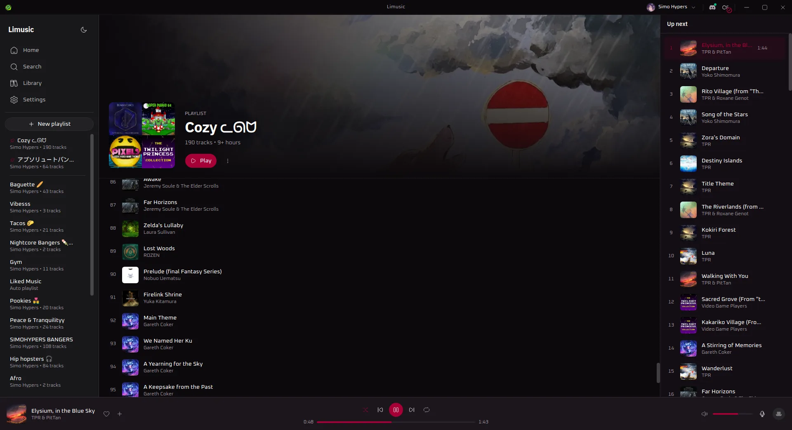
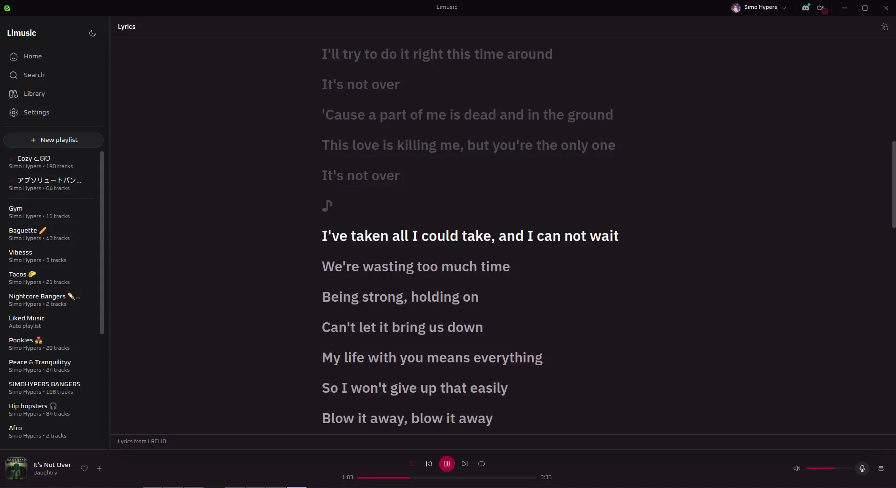
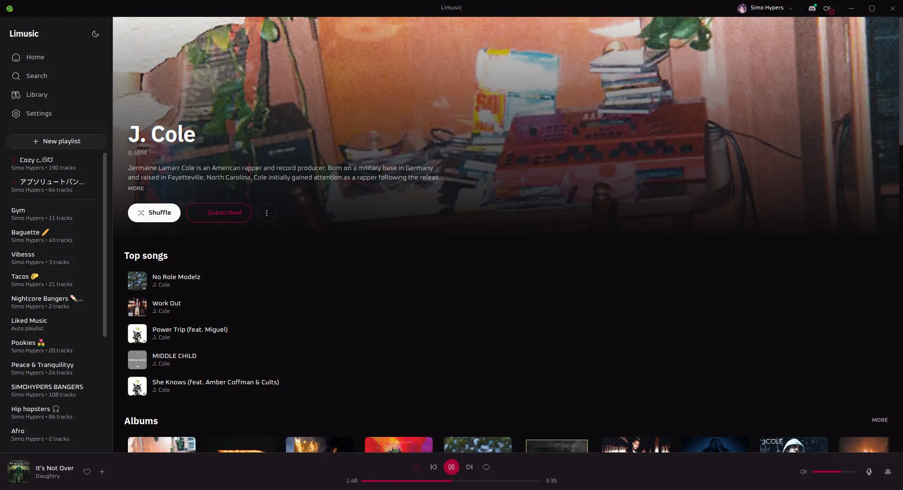
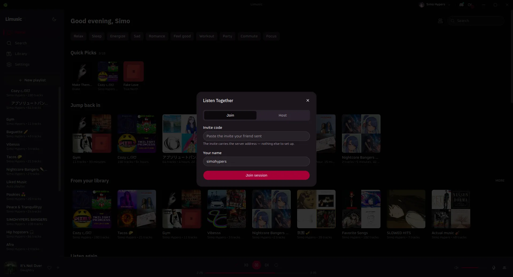

<div align="center">


# Limusic
**A native desktop YouTube Music client — Rust + Tauri, ad-free, no Electron.**

<p align="center">
  <a href="https://github.com/Naitik571/limusic/releases/latest"></a>
  <a href="https://github.com/Naitik571/limusic/releases/latest"></a>
  
  <br>
  
  
  
</p>

**Limusic** talks directly to YouTube's internal API and plays audio through libmpv — no bundled
browser runtime, no backend server, no ads in the audio. It started as a desktop rebuild of the
playback engine behind [Metrolist](https://github.com/mostafaalagamy/Metrolist), an Android
YouTube Music client, and grew from there.

</div>

---

## Screenshots

| Playlist | Lyrics |
|---|---|
|  |  |

| Artist | Listen Together |
|---|---|
|  |  |

---

## Features
- **Ad-free playback** — streams come straight from YouTube's API, ads never do; gapless through libmpv, with smart crossfade and harmonic Best Mix sorting
- **Karaoke lyrics from 8 sources** — LRCLIB, Boidu, Unison, QRC, NetEase, Musixmatch, Kugou, SimpMusic, with word-by-word sweep, translation, transliteration and a tap-along timing composer
- **Offline downloads** — per-track, per-playlist (parallel, skips what's on disk, quarantines repeat failures), auto-offline for new likes, persistent offline badges, plays straight from disk
- **Queue that keeps playing** — radio/automix continuation, drag-to-reorder, type-to-filter, clear-played, restored across restarts
- **Layouts & themes** — Default, Grove, Canopy, Compact, Wide, plus a Poolside beta; accent presets (Rose/Blue/Lime/Purple/Teal/Catppuccin) that can follow the album art, font overrides, ambient mode and Canvas loops
- **Everywhere control** — Ctrl+K palette, rebindable shortcuts, full gamepad support (even tray-minimized), OS media keys, system tray, LAN remote from your phone, synced Listen Together rooms
- **Connected** — Last.fm scrobbling, Discord Rich Presence, channel switcher for multi-channel accounts
- **Self-updating** Windows builds + Ctrl/Cmd +/− zoom

---

## Changelog

See [CHANGELOG.md](./CHANGELOG.md) for the full version history.

---

<h2 align="center">Download & Install</h2>

<p align="center">
  <a href="https://github.com/Naitik571/limusic/releases/latest">
    
  </a>
</p>

| Platform | File | Notes |
|---|---|---|
| Windows | `-setup.exe` | Self-updating |
| Windows | `.msi` | Plain installer, no auto-update |

More screenshots, feature tour and OS-detected download cards on the [website](https://simohypers.github.io/limusic/).

---

## Keyboard Shortcuts

OS media keys (SMTC on Windows) work even while the window is
unfocused. Inside the app, the standard set follows YT Music's web conventions:

| Key | Action |
|---|---|
| `Space` / `K` | Play / pause |
| `Shift` + `N` / `Shift` + `P` | Next / previous track |
| `M` | Mute (restores the previous level) |
| `↑` / `↓` | Volume +5 / −5 |
| `←` / `→` | Seek −5s / +5s |
| `J` / `L` | Seek −10s / +10s |

Shortcuts yield to whatever is focused: typing in a search box, or Space on a
focused button, still do the native thing. Every shortcut is remappable from
Settings → Shortcuts, with clash detection.

---

## Gamepad

Plug in an Xbox / PlayStation / JoyCon (any pad GilRs supports) and it drives
playback from a background thread — so it works **even when the app is minimized to
the tray**, no focus needed. Buttons:

| Button | Action |
|---|---|
| `A` (South) | Play / pause |
| `B` (East) | Next track |
| `X` (West) | Previous track |
| `Y` (North) | Mute |
| `Select` / Back | Previous track |
| `LB` / `RB` | Seek −10s / +10s |
| `LT` / `RT` (triggers) | Volume −5 / +5 |
| D-pad ↑ / ↓ | Volume +5 / −5 |
| D-pad ← / → | Seek −10s / +10s |
| Left stick X | Seek (hold, ~10 Hz) |
| Left stick Y | Volume (hold, ~10 Hz) |
| Right stick X | **Fast seek** −30s / +30s (hold) |
| `Start` | Toggle the mini player |

The mapping is fixed for now; if your pad isn't detected, make sure it's connected
before the app starts (hot-plug is best-effort).

---

## Scrobbling & Discord

Both live in the title bar, next to the window controls.

- **Last.fm** — click the Last.fm mark, approve Limusic in the browser tab that
  opens, and you're connected for good. Tracks scrobble at the halfway point (or
  four minutes, whichever comes first), which is Last.fm's own rule. Click again
  to see the account or disconnect.
- **Discord** — click the Discord mark to toggle Rich Presence. Green dot means
  it's live. The card shows the track, artist, album art, and a progress bar, and
  it disappears when you pause.

Building from source? Last.fm needs your own API credentials — they're not in the
repo. Get a key at [last.fm/api/account/create](https://www.last.fm/api/account/create)
and put it in `src-tauri/lastfm.keys`:

```
LIMUSIC_LASTFM_API_KEY=your_key
LIMUSIC_LASTFM_API_SECRET=your_secret
```

Without that file everything else still builds and runs; the Last.fm button just
reports that it isn't configured.

---

## Lyrics

Open the panel with the microphone button in the player bar, next to the queue
button. It takes the same side of the window as the queue, so opening one closes
the other.

Lyrics come from [LRCLIB](https://lrclib.net) first, then YouTube Music's own
timed lyrics, falling back to plain un-timed text when nobody has a synced
version. Matching is keyed on the track's exact length, because popular songs
exist as several cuts and the wrong one drifts a few seconds out. Results are
cached locally, so replaying a track is instant.

Note that YouTube Music's lyrics are licensed per region and are missing
entirely in some countries — where that's the case, LRCLIB does all the work.

---

## Listen Together

Synced listening with friends. Everyone streams their own audio from YouTube;
the room only relays play/pause, seeks, track changes and the queue. One person
hosts the relay:

```bash
cargo run -p sync-server        # plain WebSocket on 0.0.0.0:8080
```

Front it with something that terminates TLS (Tailscale Funnel, Cloudflare
Tunnel), then paste the `wss://` URL into the Listen Together panel in the app.
Rooms have join codes and the host approves every join and every track
suggestion.

---

## Building from Source

Windows:

```powershell
# 1. libmpv dev package (shinchiro build) — put libmpv-2.dll + mpv.lib in .libmpv\ and point the
#    linker at it. See docs/BUILD-PLATFORMS.md for the exact steps.
$env:RUSTFLAGS = "-L native=C:\path\to\.libmpv"
# 2. Frontend deps, then the build.
cd ui && pnpm install && cd ..
cargo tauri build
```

Full Windows instructions live in [docs/BUILD-PLATFORMS.md](docs/BUILD-PLATFORMS.md).

---

## How It Works, Briefly

- A pure Rust crate speaks YouTube's InnerTube API, impersonating several
  official client identities and falling back between them when one fails.
- YouTube's stream URLs are protected by obfuscated JavaScript (the signature
  cipher and the `n` parameter) and by BotGuard attestation. Limusic runs that
  JavaScript where it expects to run, in a real webview, hidden, and never lets
  any of it touch the UI process.
- Audio goes through libmpv: gapless transitions and an on-disk cache.
- The UI is a SvelteKit SPA that only ever talks to the Rust core. It never
  contacts YouTube itself.

---

## Disclaimer

This project is not affiliated with, funded, authorized, endorsed by, or in
any way associated with YouTube, Google LLC, or any of their affiliates and
subsidiaries.

All trademarks, service marks, and intellectual property rights referenced in
this project belong to their respective owners.

---

## License

[GPL-3.0](LICENSE)
